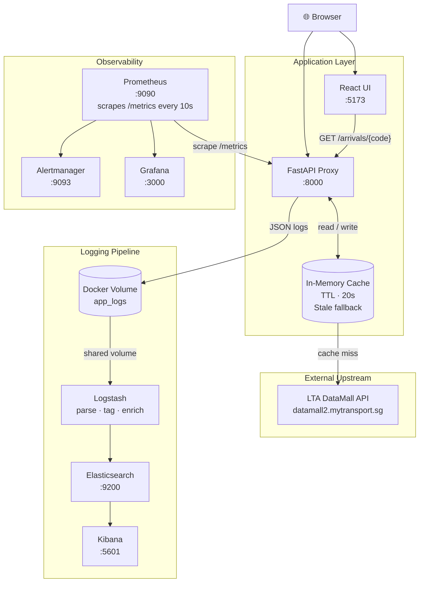

# LTA Bus Arrival Proxy

> Production-instrumented HTTP proxy over the Singapore LTA DataMall Bus Arrival API — demonstrating SLI/SLO engineering, multi-window burn-rate alerting, structured logging, and full-stack observability with Prometheus, Grafana, and the ELK stack.


> **[Dashboard Gallery](#dashboard-gallery)** — React UI · Grafana · Prometheus · Kibana · Alertmanager

---

## Key Features

| Category | Capability |
|---|---|
| **Reliability** | In-memory cache (TTL 20s) with automatic stale-cache fallback when LTA upstream is unavailable |
| **Observability** | 8 Prometheus metrics (Counters, Histograms, Gauge) — request rate, latency, cache hit/miss/stale, upstream error |
| **SLO Alerting** | Multi-window burn-rate alerts: 14× fast burn (1h window) → page; 3× slow burn (6h window) → ticket |
| **Structured Logging** | JSON log emission to stdout and file; Logstash pipeline tags slow requests, errors, and stale cache serves |
| **Cloud Deployment** | Docker Compose on AWS EC2; separate prod compose (no ELK) for resource-constrained instances |
| **Developer Experience** | Single `docker compose up --build` starts 8 services; Kibana data view auto-provisioned on first boot |

---

## Architecture



### Request flow

1. React frontend calls `GET /arrivals/{bus_stop_code}`.
2. FastAPI checks the in-memory cache. On a **hit**, it returns immediately and records `lta_cache_hits_total`.
3. On a **miss**, FastAPI calls LTA DataMall (5s timeout). On success it repopulates the cache; on failure it falls back to the stale cache and sets `X-Served-From: stale-cache`.
4. Every request — hit, miss, or stale — increments `lta_proxy_requests_total` and records latency in `lta_proxy_request_duration_seconds`.

### Monitoring pipeline

Prometheus scrapes `/metrics` every 10 seconds. Alertmanager evaluates burn-rate rules on a 30-second interval. Grafana queries Prometheus for SLO dashboards and latency panels.

### Logging pipeline

The app emits structured JSON to both stdout and `/app/logs/app.log` (in a shared Docker volume). Logstash reads the file, parses fields, applies tags (`error`, `slow`, `cache_miss`, `stale_cache`), and ships to Elasticsearch. Kibana indexes under `lta-proxy-YYYY.MM.DD`.

---

## Production Engineering Practices

### SLIs

Three Service Level Indicators are instrumented directly in [metrics.py](metrics.py):

| SLI | Metric | Description |
|---|---|---|
| Availability | `lta_proxy_requests_total{status="200"}` | Ratio of successful to total requests |
| Latency (P95) | `lta_proxy_request_duration_seconds_bucket` | End-to-end request latency histogram |
| Data freshness | `lta_bus_arrival_cache_age_seconds` | Age of the served cache entry per bus stop |

### SLOs and error budget

| SLO | Target | Error budget (30 days) |
|---|---|---|
| Availability | ≥ 99.5% | ~3.6 hours / month |
| P95 Latency | < 500 ms | — |
| Data freshness | cache age < 30s | — |

### Burn-rate alerting

Multi-window alerting ([alerts.yml](alerts.yml)) catches both sudden spikes and slow degradation:

| Alert | Window | Multiplier | Severity | Meaning |
|---|---|---|---|---|
| `LTAProxyFastBurn` | 1h | 14× | critical | Budget exhausted in ~2h at current rate |
| `LTAProxySlowBurn` | 6h | 3× | warning | ~5% of monthly budget consumed today |
| `LTAProxyHighLatency` | 5m | — | warning | P95 exceeds 500ms SLO |
| `LTAProxyStaleCacheData` | 1m | — | warning | Cache age > 30s; upstream likely degraded |
| `LTAUpstreamErrors` | 5m | — | info | LTA DataMall error rate > 0.1 req/s |

### Health checks

Docker Compose polls `GET /health` every 10 seconds. Logstash and Kibana depend on `service_healthy` from Elasticsearch before starting, preventing race-condition failures on cold boot.

### Runbooks

Every alert links to a runbook. Runbooks follow a consistent structure: symptom, impact, diagnosis steps, mitigation, and escalation path.

| Runbook | Trigger |
|---|---|
| [fast-burn.md](runbooks/fast-burn.md) | `LTAProxyFastBurn` critical |
| [slow-burn.md](runbooks/slow-burn.md) | `LTAProxySlowBurn` warning |
| [high-latency.md](runbooks/high-latency.md) | `LTAProxyHighLatency` warning |
| [stale-cache.md](runbooks/stale-cache.md) | `LTAProxyStaleCacheData` warning |

### Incident response workflow

```
Alert fires in Alertmanager
    → Engineer checks Grafana SLO dashboard (availability + P95 panels)
    → Engineer checks Kibana for ERROR-tagged log entries (filter: level=ERROR, last 15m)
    → Engineer follows linked runbook
    → If LTA upstream is the cause: stale cache is already serving — no action needed
    → If app is the cause: redeploy with `docker compose up -d --build app`
    → Post-incident: verify burn rate drops below threshold in Prometheus
```

---

## Observability Stack

### Prometheus metrics

| Metric | Type | Labels | Description |
|---|---|---|---|
| `lta_proxy_requests_total` | Counter | `endpoint`, `status` | Total requests by HTTP status code |
| `lta_proxy_request_duration_seconds` | Histogram | `endpoint` | End-to-end latency (buckets: 25ms → 5s) |
| `lta_upstream_errors_total` | Counter | `reason` | LTA DataMall errors (`timeout`, `http_502`, …) |
| `lta_upstream_request_duration_seconds` | Histogram | — | Raw LTA API call latency |
| `lta_cache_hits_total` | Counter | — | Requests served from warm cache |
| `lta_cache_misses_total` | Counter | — | Requests requiring a live upstream call |
| `lta_cache_stale_serves_total` | Counter | — | Requests served from stale cache on upstream failure |
| `lta_bus_arrival_cache_age_seconds` | Gauge | `bus_stop_code` | Age of the served cache entry (SLO: < 30s) |

### PromQL examples

```promql
# Availability over the last 1 hour
1 - (
  rate(lta_proxy_requests_total{status="200"}[1h])
  / rate(lta_proxy_requests_total[1h])
)

# P95 request latency
histogram_quantile(0.95,
  rate(lta_proxy_request_duration_seconds_bucket{endpoint="arrivals"}[5m])
)

# Cache hit rate
rate(lta_cache_hits_total[5m])
  / (rate(lta_cache_hits_total[5m]) + rate(lta_cache_misses_total[5m]))

# Fast burn condition
(1 - rate(lta_proxy_requests_total{status="200"}[1h]) / rate(lta_proxy_requests_total[1h])) > (14 * 0.005)
```

### Grafana dashboards

Pre-provisioned via `grafana/provisioning/` — no manual setup required:

- **SLO Overview**: availability gauge, error budget burn rate, P95 latency
- **Request Throughput**: RPS, error rate, status code breakdown
- **Cache Performance**: hit/miss/stale rates, cache age per bus stop
- **Upstream Health**: LTA DataMall latency, error rate by reason

### Logstash enrichment

[logstash/pipeline/logstash.conf](logstash/pipeline/logstash.conf) applies the following tags automatically:

| Tag | Condition |
|---|---|
| `error` | `level = ERROR` |
| `slow` | `duration_ms > 300` |
| `cache_miss` | `cache = miss` |
| `stale_cache` | `cache = stale` |

---

## Deployment

### v1 — Local Docker Compose

Full 8-container stack on a single machine. Suitable for development and learning.

```bash
git clone https://github.com/sparkling-snail/lta-proxy
cd lta-proxy
cp .env.example .env   # add LTA_API_KEY
docker compose up --build
```

| Service | URL |
|---|---|
| React UI | http://localhost:5173 |
| API | http://localhost:8000 |
| Grafana | http://localhost:3000 |
| Prometheus | http://localhost:9090 |
| Alertmanager | http://localhost:9093 |
| Kibana | http://localhost:5601 |

### v2 — AWS EC2 (current)

Deployed on a single EC2 instance. Demonstrates cloud-native deployment without Kubernetes overhead.

**Instance requirements:**
- Full stack (with ELK): `t3.medium` — 4GB RAM, 20GB gp3
- Observability only (no ELK): `t3.micro` — 1GB RAM
- Security group: inbound `22`, `8000`, `5173`, `3000`, `9090`, `9093`, `5601`

```bash
# Provision the server
curl -fsSL https://get.docker.com | sh
sudo usermod -aG docker ubuntu && newgrp docker

# Deploy
git clone https://github.com/sparkling-snail/lta-proxy && cd lta-proxy
cp .env.example .env && nano .env

# Full stack (t3.medium)
docker compose up -d --build

# Without ELK (t3.micro — saves ~1.5GB RAM)
docker compose -f docker-compose.prod.yml up -d --build
```

<details>
<summary>Useful operational commands</summary>

```bash
docker compose logs -f app          # tail application logs
docker compose ps                   # check container health
docker compose up -d --build app    # rolling redeploy (app only)
docker compose down                 # stop all services
docker stats                        # live resource usage
```

</details>

### v3 — AWS EKS (planned)

| Component | Tool |
|---|---|
| Infrastructure | Terraform — VPC, EKS cluster, managed node group, IAM roles |
| Application | Kubernetes Deployment + Service + HPA + ConfigMap + Secret |
| Ingress | AWS Load Balancer Controller |
| Observability | `kube-prometheus-stack` via Helm (Prometheus Operator, Grafana, Alertmanager) |
| CI/CD | GitHub Actions — build → ECR push → `kubectl rollout restart` |

---

## Project Structure

```
lta-proxy/
├── app.py                      # FastAPI application: proxy logic, cache, structured logging
├── metrics.py                  # All Prometheus metric definitions (Counters, Histograms, Gauge)
├── alerts.yml                  # SLO burn-rate alert rules for Prometheus/Alertmanager
├── prometheus.yml              # Prometheus scrape config and rule references
├── docker-compose.yml          # Full 8-container stack (app + observability + ELK)
├── docker-compose.prod.yml     # Production compose without ELK (for memory-constrained hosts)
├── Dockerfile                  # App container (python:3.12-slim + curl for health check)
├── requirements.txt            # Python dependencies
├── .env.example                # Environment variable template
│
├── frontend/                   # React + Vite UI
│   ├── src/App.jsx             # Main app: search, auto-refresh (20s), stale banner
│   ├── src/components/         # BusCard, ArrivalPill with load-factor colours
│   └── Dockerfile              # 2-stage build: node:20-alpine → nginx:alpine
│
├── grafana/
│   └── provisioning/           # Auto-provisioned datasources and dashboards (no UI setup needed)
│
├── alertmanager/
│   └── alertmanager.yml        # Alertmanager routing and receiver config
│
├── logstash/
│   ├── pipeline/logstash.conf  # Input (file) → filter (parse + tag) → output (elasticsearch)
│   └── config/logstash.yml     # Logstash JVM and pipeline settings
│
├── kibana/
│   └── setup.sh                # One-shot container: waits for Kibana, creates lta-proxy-* data view
│
└── runbooks/                   # Markdown runbooks linked from every Alertmanager alert
    ├── fast-burn.md
    ├── slow-burn.md
    ├── high-latency.md
    └── stale-cache.md
```

---

## Dashboard Gallery


---

## Runbooks

Each alert in [alerts.yml](alerts.yml) carries a `runbook` annotation linking directly to the relevant file. Runbooks follow a four-step structure:

1. **Symptom** — what the alert means in plain English
2. **Diagnosis** — PromQL queries and Kibana filters to confirm the root cause
3. **Mitigation** — ordered steps to restore service within the error budget
4. **Escalation** — when to escalate and to whom

The stale-cache runbook is the most illustrative: when LTA DataMall is degraded, the proxy already falls back to stale data automatically. The runbook confirms this is happening (via `lta_cache_stale_serves_total`) and determines whether user-facing impact is acceptable before paging.

---

## Roadmap

- [x] FastAPI proxy with in-memory cache and stale fallback
- [x] Prometheus SLI instrumentation (8 metrics)
- [x] SLO definitions and multi-window burn-rate alerting
- [x] Grafana dashboards (pre-provisioned)
- [x] Structured JSON logging (stdout + file)
- [x] ELK stack: Logstash pipeline, Elasticsearch, Kibana auto data view
- [x] React frontend with load-factor colours and stale banner
- [x] Docker Compose multi-service orchestration (8 containers)
- [x] AWS EC2 deployment (full stack + prod compose without ELK)
- [ ] Push images to AWS ECR
- [ ] Terraform: VPC + EKS cluster + managed node group + IAM
- [ ] Kubernetes manifests: Deployment, Service, HPA, ConfigMap, Secret
- [ ] AWS Load Balancer Controller for public ingress
- [ ] `kube-prometheus-stack` via Helm
- [ ] GitHub Actions CI/CD: build → ECR → rollout restart

---

## Technologies Used

| Category | Technology | Version |
|---|---|---|
| **Language** | Python | 3.12 |
| **Language** | JavaScript (React + Vite) | Node 20 |
| **API framework** | FastAPI + uvicorn | 0.110 |
| **Async HTTP** | httpx | latest |
| **Metrics** | Prometheus + prometheus-client | 2.52 |
| **Dashboards** | Grafana | 10.4 |
| **Alerting** | Alertmanager | 0.27 |
| **Log storage** | Elasticsearch | 8.13 |
| **Log pipeline** | Logstash | 8.13 |
| **Log UI** | Kibana | 8.13 |
| **Containerization** | Docker + Docker Compose | latest |
| **Frontend serving** | nginx | alpine |
| **Cloud** | AWS EC2 | t3.medium / t3.micro |
| **Config** | python-dotenv | latest |

---

## Local Development

**Prerequisites:** Docker Desktop, [LTA DataMall API key](https://datamall.lta.gov.sg/content/datamall/en/request-for-api.html) (free)

```bash
git clone https://github.com/sparkling-snail/lta-proxy
cd lta-proxy
cp .env.example .env        # add LTA_API_KEY=<your-key>
docker compose up --build
```

Verify:

```bash
curl http://localhost:8000/arrivals/83139     # real-time bus data
curl http://localhost:8000/metrics | grep lta_ # Prometheus metrics
```

**Key bus stops for testing:**

| Code | Location |
|---|---|
| `83139` | Sengkang Bus Interchange |
| `75009` | Tampines Bus Interchange |
| `01012` | Victoria St opp. National Library |
| `65199` | Compassvale Rd |

---

## Lessons Learned

### SLI design is harder than instrumentation

Choosing _what_ to measure is the real work. `lta_bus_arrival_cache_age_seconds` (data freshness) is more operationally meaningful than raw request rate for a caching proxy — it directly reflects whether users see stale or live data. The decision to track this as a Gauge per `bus_stop_code` came from understanding the failure mode: LTA goes down, cache grows stale, but requests still succeed (200 OK). A pure availability SLI would miss this entirely.

### Multi-window burn-rate alerting over simple thresholds

A fixed error-rate threshold fires constantly on minor blips and misses slow degradation. The Google SRE Book's multi-window approach (fast burn = page immediately, slow burn = create a ticket) gives appropriate urgency without alert fatigue. The 14× multiplier means a critical alert fires only when the monthly error budget will be exhausted within ~2 hours.

### Stale-cache fallback as a reliability primitive

Serving stale data is almost always better than serving an error. The proxy's `X-Served-From: stale-cache` header and `lta_cache_stale_serves_total` counter make this behaviour observable — engineers can confirm the fallback is working without inspecting logs, and Grafana can surface it as an informational panel rather than an alert.

### Structured logging pays off immediately

Switching from plaintext to JSON logs (`{"timestamp": ..., "level": ..., "duration_ms": ..., "cache": "stale"}`) meant Logstash could tag and filter without regex fragility. Kibana filters like `cache:stale AND duration_ms:>300` became trivial. The cost was minimal; the operational benefit on day one was significant.

### Resource constraints force architectural decisions

ELK stack at default heap settings consumes ~1.5GB RAM — more than a t3.micro's total memory. This forced a split into two compose files: the full stack for development and investigation (t3.medium) and a lean prod compose for cost-sensitive deployments (t3.micro). In production Kubernetes this trade-off is managed differently (DaemonSet log shippers, remote Prometheus), but understanding _why_ the split exists is the transferable insight.
